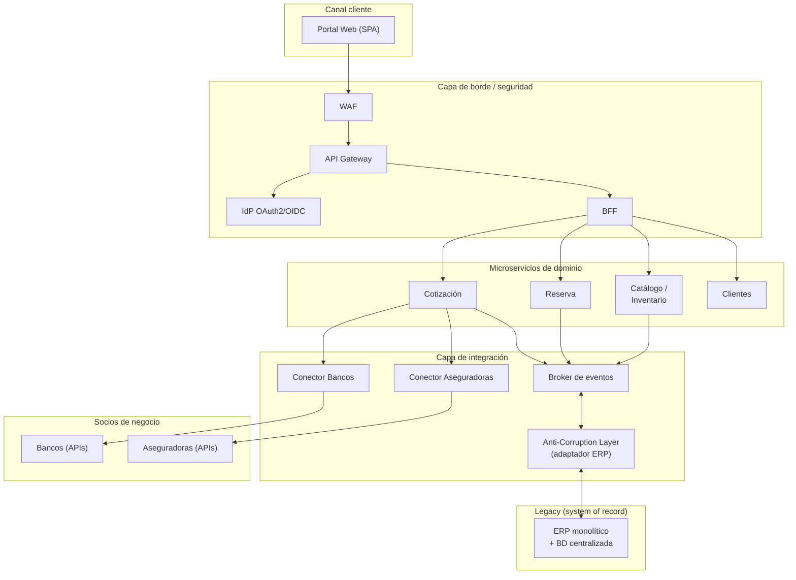
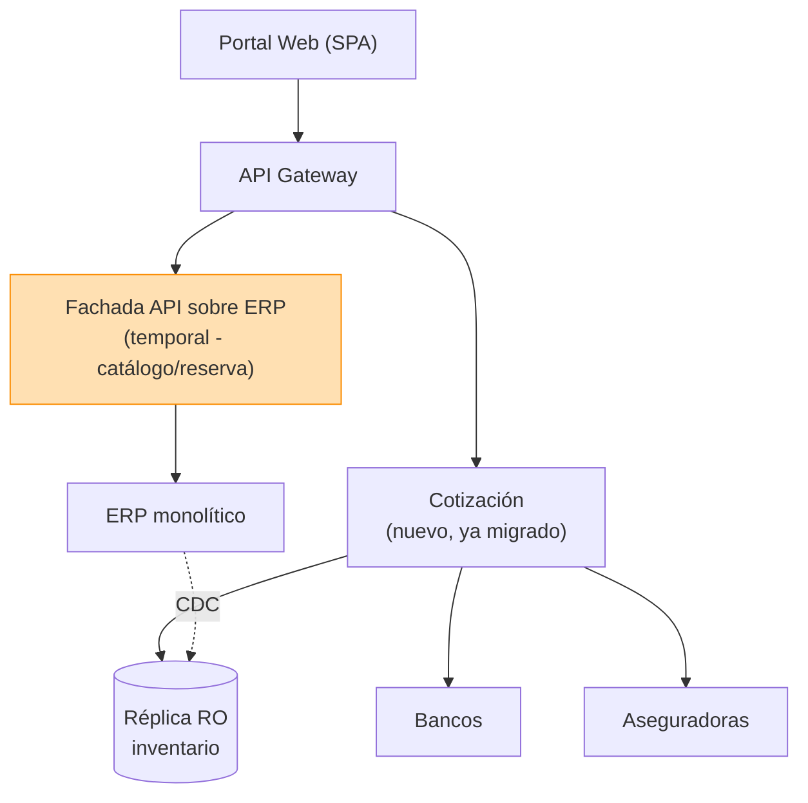
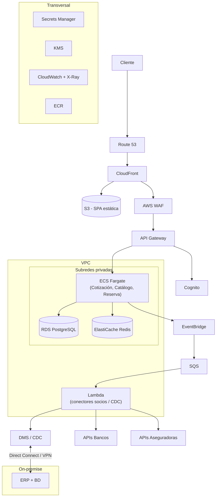
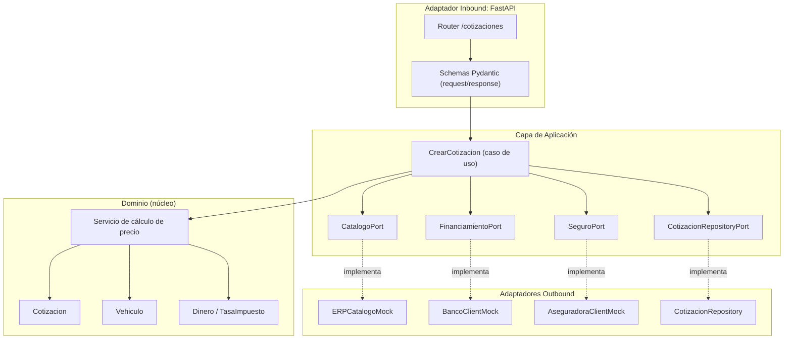

# Diseño — Portal Digital "Auto Ventas" e Integración del ERP

- **Fecha:** 2026-07-06
- **Autor:** Mynor Molina
- **Estado:** Aprobado para especificación
- **Caso:** Concesionaria con ERP monolítico centralizado que requiere portal web
  (inventario, cotización, reserva) e integración con socios (bancos, aseguradoras).
- **Referencia estado actual:** [`referencia_erp_actual.md`](../../../referencia_erp_actual.md)

---

## 1. Contexto y objetivos

**Auto Ventas** es una concesionaria que hoy opera un **ERP monolítico** con base de
datos centralizada (módulos de Compras, Producción, Finanzas, Cuentas). No existe
capa de integración ni canal digital para clientes.

Objetivos de negocio:

1. Exponer un **portal web** con inventario, **cotización** y **reserva** de vehículos.
2. **Integrarse con socios**: bancos (cotización de préstamos) y aseguradoras
   (contratación de seguros).
3. Impulsar ventas sin poner en riesgo la estabilidad del ERP transaccional.

Principio rector: **el ERP sigue siendo el system of record**. La nueva plataforma se
construye *alrededor* de él mediante un **Anti-Corruption Layer (ACL)** y patrón
**Strangler Fig**, nunca reemplazándolo de golpe ni consultándolo directamente desde
canales públicos.

### Decisiones tomadas
| Tema | Decisión |
|------|----------|
| Nube | AWS |
| Stack piloto | Python 3.12 + FastAPI |
| Arquitectura piloto | Hexagonal (puertos y adaptadores) |
| Alcance piloto | Esqueleto completo + lógica de cotización real; integraciones y despliegue simulados/documentados |
| Diagramas | Mermaid en Markdown + C4 (contexto/contenedor/componente) |
| Moneda | USD |

---

## 2. Requisitos

### 2.1 Funcionales (plataforma)
- RF-01: Consultar catálogo/inventario de vehículos disponible.
- RF-02: Generar una **cotización** de un vehículo (precio base + impuestos + extras).
- RF-03: Adjuntar a la cotización opciones de **financiamiento** de uno o más bancos.
- RF-04: Adjuntar a la cotización opciones de **seguro** de una o más aseguradoras.
- RF-05: **Reservar** un vehículo a partir de una cotización.
- RF-06: Autenticación de clientes y sesión segura.

### 2.2 Funcionales (piloto — Cotización)
- RFP-01: Dado un `vehiculo_id` y datos del cliente, calcular precio total en USD.
- RFP-02: Aplicar impuestos configurables por región (tasa parametrizable).
- RFP-03: Solicitar en paralelo cotizaciones de financiamiento a bancos y de seguro a
  aseguradoras.
- RFP-04: Devolver una cotización consolidada con vigencia (fecha de expiración).
- RFP-05: Persistir la cotización para consulta/reserva posterior.

### 2.3 No funcionales
- RNF-01 **Desacople del ERP:** ningún canal público consulta el ERP en línea; se usa
  ACL + réplica/eventos.
- RNF-02 **Resiliencia:** las integraciones con socios son opcionales y degradables
  (timeouts, circuit breaker, respuestas parciales).
- RNF-03 **Seguridad:** OAuth2/OIDC, JWT, TLS, secretos gestionados, mínimo privilegio.
- RNF-04 **Observabilidad:** logs estructurados, trazas distribuidas, métricas.
- RNF-05 **Idempotencia:** creación de cotización/reserva idempotente por clave de cliente.
- RNF-06 **Escalabilidad horizontal** de los microservicios.
- RNF-07 **Auditabilidad:** toda cotización y reserva queda registrada e inmutable.

---

## 3. Entregable 1 — Arquitectura objetivo (to-be)

Arquitectura orientada a microservicios y eventos, con capa de integración explícita.



Puntos clave:
- **BFF** adapta las respuestas al portal (evita sobre-exposición de servicios).
- **ACL** traduce el modelo del ERP al modelo de dominio y aísla cambios del legacy.
- **Broker de eventos** desacopla la sincronización de inventario/ventas del core.
- **Conectores de socios** encapsulan protocolos y contratos de cada banco/aseguradora.

---

## 4. Entregable 2 — Arquitectura transitoria (coexistencia)

Migración incremental con **Strangler Fig**: el portal sale a producción antes de que
todos los microservicios existan, apoyado en una **fachada API mínima** sobre el ERP y
una **réplica de solo lectura** del inventario para no golpear el core.



- **Fase 1:** Cotización (piloto) migrada a microservicio; catálogo y reserva aún vía
  fachada sobre ERP.
- **Fase 2:** Se estrangula catálogo → microservicio con réplica alimentada por CDC.
- **Fase 3:** Se estrangula reserva; la fachada se retira cuando ya no tiene consumidores.
- La **réplica de solo lectura** (CDC) protege el core desde la fase 1.

---

## 5. Entregable 3 — Arquitectura en la nube (AWS)



- **Front estático** en S3 + CloudFront; **WAF** en el borde.
- **Cómputo:** ECS Fargate para microservicios; **Lambda** para conectores y CDC.
- **Datos:** RDS PostgreSQL (portal) + ElastiCache (cache de cotizaciones/catálogo).
- **Integración:** EventBridge + SQS; **DMS/CDC** desde ERP on-prem por Direct Connect/VPN.
- **Seguridad/ops:** Cognito, Secrets Manager, KMS, CloudWatch + X-Ray.
- **Entrega:** GitHub Actions → ECR → ECS; **IaC con Terraform**.

---

## 6. Entregable 4 — Piloto: Microservicio de Cotización

### 6.1 Arquitectura hexagonal (puertos y adaptadores)

- **Domain (núcleo puro):** entidades `Vehiculo`, `Cotizacion`, `LineaCotizacion`;
  value objects `Dinero(USD)`, `TasaImpuesto`; reglas de cálculo. Sin dependencias de
  framework.
- **Application:** caso de uso `CrearCotizacion`; **puertos** (interfaces):
  `CatalogoPort` (datos del vehículo desde ERP/réplica), `FinanciamientoPort` (banco),
  `SeguroPort` (aseguradora), `CotizacionRepositoryPort` (persistencia).
- **Adapters:**
  - *Inbound:* API REST FastAPI (`/cotizaciones`).
  - *Outbound:* `ERPCatalogoMock`, `BancoClientMock`, `AseguradoraClientMock`,
    `CotizacionRepositoryInMemory` (o SQLAlchemy).

### 6.2 Diagrama C4 — nivel componente (piloto)



### 6.3 Estructura de carpetas propuesta

```
practica/piloto-cotizacion/
├── src/cotizacion/
│   ├── domain/            # entidades, value objects, servicios de dominio
│   ├── application/       # casos de uso + puertos (interfaces)
│   └── adapters/
│       ├── inbound/rest/  # FastAPI routers + schemas
│       └── outbound/      # mocks ERP/banco/aseguradora + repositorio
├── tests/                 # pytest (unit dominio + integración caso de uso)
├── docs/adr/              # Architecture Decision Records
├── Dockerfile
├── docker-compose.yml
├── pyproject.toml
├── .github/workflows/ci.yml
└── README.md
```

### 6.4 Tooling y calidad
- **Tests:** pytest, TDD (dominio primero). Cobertura del cálculo de precio y del caso de uso.
- **Contenedores:** Dockerfile multi-stage + docker-compose.
- **CI/CD:** GitHub Actions — lint (ruff), format check, tests, build de imagen.
- **Documentación:** OpenAPI/Swagger autogenerado por FastAPI + README + **ADRs**.
- **Seguridad:** validación con Pydantic, autenticación JWT (bearer), secretos por
  variables de entorno, sin credenciales en código.
- **Control de versiones:** git con Conventional Commits.

---

## 7. Edge cases (análisis con énfasis)

> Sección clave: escenarios límite detectados al analizar la solución, con la decisión
> de diseño para cada uno.

### 7.1 Integración con socios (bancos / aseguradoras)
- **EC-01 Timeout de un socio:** el banco no responde en N segundos → se aplica
  **timeout** y la cotización se devuelve **parcial** (sin esa oferta), marcada como
  `financiamiento: no_disponible`. Nunca se bloquea la cotización completa.
- **EC-02 Socio caído (circuit breaker):** tras M fallos consecutivos se abre el circuito
  y se deja de llamar a ese socio por un periodo; se sirve degradado.
- **EC-03 Respuestas parciales:** 2 de 3 bancos responden → se consolidan las ofertas
  disponibles; el consumidor sabe cuáles faltaron.
- **EC-04 Datos inconsistentes del socio:** oferta con monto negativo o tasa fuera de
  rango → se descarta esa oferta y se registra el evento, no se propaga basura.
- **EC-05 Reintentos idempotentes:** los reintentos a socios usan clave de idempotencia
  para no duplicar solicitudes de crédito/seguro.

### 7.2 Datos del ERP / catálogo
- **EC-06 Vehículo inexistente:** `vehiculo_id` no está en catálogo → `404`, sin llamar
  a socios.
- **EC-07 Vehículo sin stock / reservado:** existe pero no disponible → se cotiza pero
  se marca `disponible: false` (se puede cotizar, no reservar).
- **EC-08 Precio del ERP desactualizado / réplica rezagada:** la cotización guarda el
  precio **al momento de cotizar** y una **vigencia (expiración)**; pasada la vigencia
  se recalcula.
- **EC-09 Moneda:** todo se normaliza a **USD**; si el ERP entrega otra moneda, el ACL
  convierte o rechaza explícitamente (no asume).

### 7.3 Cálculo y dinero
- **EC-10 Redondeo monetario:** se opera con **Decimal** (no float) y redondeo
  bancario a 2 decimales para evitar errores de centavos.
- **EC-11 Tasa de impuesto ausente/ inválida:** región sin tasa configurada → error de
  configuración explícito (fail-fast), no impuesto 0 silencioso.
- **EC-12 Descuentos que exceden el precio:** un extra/descuento no puede dejar el total
  negativo → se acota a 0 y se registra.

### 7.4 Concurrencia e idempotencia
- **EC-13 Doble envío (doble click):** clave de idempotencia por cliente+vehículo dentro
  de una ventana → devuelve la misma cotización en vez de crear duplicados.
- **EC-14 Reserva sobre cotización expirada:** al reservar se **revalida vigencia**; si
  expiró, se obliga a recotizar.
- **EC-15 Carrera de reservas del mismo vehículo:** la reserva definitiva la confirma el
  ERP (system of record); el portal solo **solicita**, y maneja el rechazo por
  "ya reservado".

### 7.5 Seguridad y entrada
- **EC-16 Entrada maliciosa/ inválida:** validación estricta con Pydantic; IDs y montos
  tipados; rechazo `422` antes de tocar dominio.
- **EC-17 Token ausente/ expirado:** `401`; ningún cálculo ni llamada a socios sin auth.
- **EC-18 Enumeración de recursos:** los IDs de cotización son opacos (UUID) para evitar
  adivinación secuencial.
- **EC-19 Fuga de datos de socios:** las respuestas al portal no exponen contratos ni
  credenciales internas de bancos/aseguradoras; el BFF/serializador filtra.

### 7.6 Resiliencia general
- **EC-20 Fallo de persistencia:** si no se puede guardar la cotización, se responde
  error controlado; no se devuelve una cotización "fantasma" no persistida.
- **EC-21 Degradación total de socios:** aun sin ningún socio disponible, se entrega la
  cotización base del vehículo (precio + impuestos), con financiamiento/seguro vacíos.

---

## 8. Alcance explícito del piloto (qué sí / qué no)

**Incluye (ejecutable/código clave):**
- Dominio + caso de uso `CrearCotizacion` con lógica real de precio, impuestos y
  consolidación de ofertas.
- API REST FastAPI con OpenAPI.
- Mocks de ERP/banco/aseguradora que **simulan** los edge cases (timeout, caído, parcial).
- Tests unitarios de dominio e integración del caso de uso (incluyendo edge cases).
- Dockerfile, docker-compose, CI de GitHub Actions, README y ADRs.

**No incluye (documentado, no desplegado):**
- Terraform ejecutado en AWS real; despliegue a ECS.
- Integración real con APIs de bancos/aseguradoras productivas.
- Portal SPA (fuera del piloto de backend de cotización).

---

## 9. Riesgos y mitigaciones
| Riesgo | Mitigación |
|--------|------------|
| Acoplamiento accidental al ERP | ACL + puertos; el dominio no conoce el ERP |
| Latencia por socios lentos | Timeouts + llamadas en paralelo + degradación |
| Errores monetarios | Decimal + redondeo bancario + tests |
| Cotizaciones obsoletas | Vigencia/expiración + revalidación en reserva |
| Duplicados | Idempotencia por clave |
