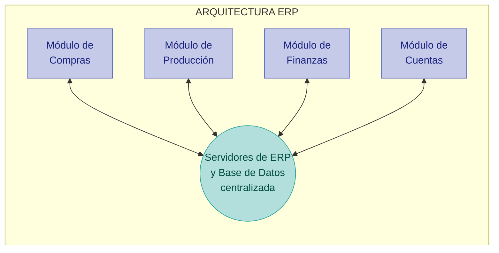

# Referencia — Arquitectura ERP actual (estado "as-is")

> Recreación fiel del diagrama proporcionado en el enunciado del caso práctico.
> Representa el sistema tal como existe **hoy**: un ERP monolítico centralizado,
> **sin capa de integración** y **sin portales web**.

## Diagrama

## Descripción

- **Núcleo:** Servidores de ERP con una **base de datos centralizada** que concentra
  todos los datos del negocio (inventario, ventas, clientes, proveedores, etc.).
- **Módulos** que se comunican de forma bidireccional con el núcleo:
  - Módulo de **Compras**
  - Módulo de **Producción**
  - Módulo de **Finanzas**
  - Módulo de **Cuentas**

## Puntos clave para el diseño objetivo

Estas son las limitaciones/observaciones del estado actual que motivan la propuesta:

1. **No existe capa de integración** — no hay forma estándar (API/eventos) de exponer
   datos del ERP hacia afuera ni de integrar socios (bancos, aseguradoras).
2. **No existen portales web** — no hay canal digital para clientes finales
   (inventario, cotización, reserva).
3. **Base de datos centralizada / acoplamiento fuerte** — cualquier consumo externo
   directo contra el ERP arriesga rendimiento y estabilidad del core transaccional.
4. El ERP debe seguir siendo la **fuente de verdad (system of record)**; la nueva
   arquitectura se construye *alrededor* de él, no lo reemplaza.
